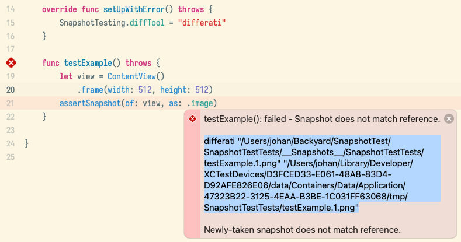
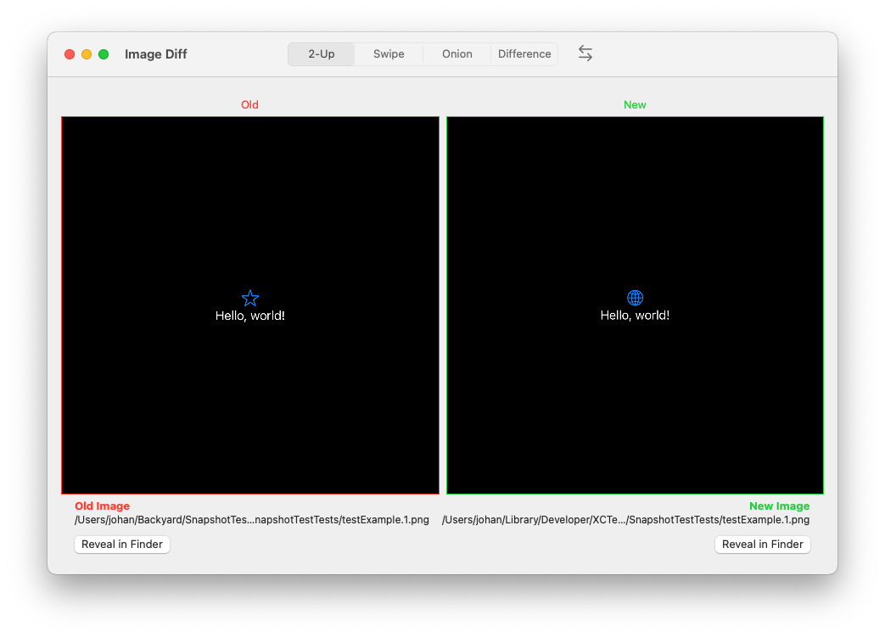
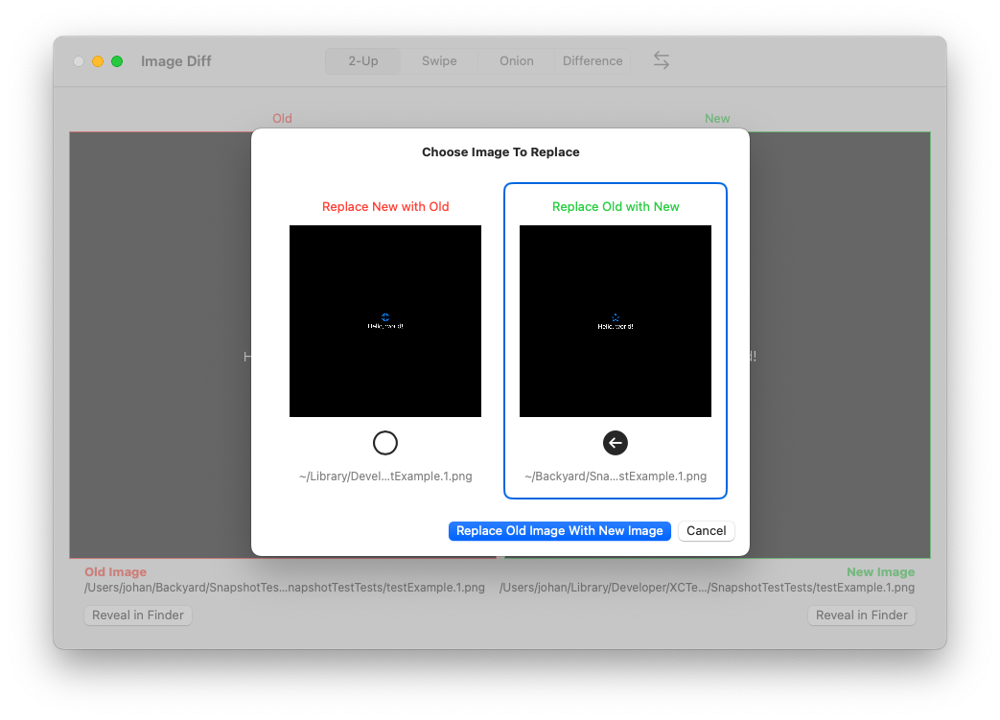

  
  <h1 align="center">Differati</h1>

Differati is a macOS app for visually showing differences between two images. _Differati sees all change (between two images)_

## Motivation & Usage

It was born out of frustration working with [`swift-snapshot-testing`](https://github.com/pointfreeco/swift-snapshot-testing) test failures within Xcode. I find Xcode's test navigator clunky and it seems to not always update the diff it shows of the snapshots.

Differati comes with a command line utility to easily open image diffs, it can be installed from the main macOS app. By invoking it with the two image files to compare, eg `differati old.png new.png`, it will open the main app and visually show the differences.

By setting the `differati` command line tool as `SnapshotTesting.diffTool` image snapshots tests can easily be diffed from failed tests, and the saved snapshot can be updated or discarded. It is probably useful for other similar snapshot testing scenarios using a similar approach.

Copying the command and running it from the terminal (command line client can be install from the main macOS app) will open up Differati in compare mode, comparing to two images. You can also chose to either overwrite the old or new image, to update the snapshot test image.

Besides the command line client, Differati also supports the `differati://` URL scheme for opening a new compare view:
`differati://show?old=/fully/url-encoded/path.png&new=/fully/url-encoded/other-path.png`

## Features

- 2-Up: Side by side comparison: 
- Swipe: swipe left right to reveal differences
- Onion: change opacity to reveal differences
- Difference: Only differences between the two images are shown, optioncally with false color
- Easily overwrite old image with new, or the other way around

## Installation

Build and run from Xcode, or download the prebuilt binary from the [project's Github releases](https://github.com/js/Differati/releases)

## License

Licensed under the MIT license. See [LICENSE.md](https://github.com/js/Differati/blob/main/LICENSE.md) for details.

## Orignal Author

[Johan Sørensen](https://github.com/js)
